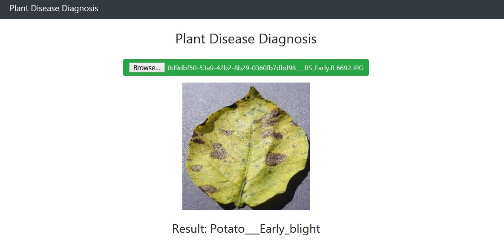

# Plant-Disease-Diagnosis-Flask
Online Flask Web App for Plant Disease Diagnosis from Images <br>

<br><br>

---

## 🚀 Features Added

- 🌿 **Image-based Plant Disease Prediction** using a trained TensorFlow model (`PlantDNet.h5`)
- 📝 **Note-taking System**: Create, read, update, and delete notes linked to each diagnosis
- 🔗 **Diagnosis-ID Based Association** for notes (via `diagnosis_id`)
- 🔄 **RESTful API for Notes** with full CRUD functionality (Flask + SQLAlchemy)
- 🧪 **Unit Testing** for all key endpoints and logic using `unittest` + `coverage`
- 📊 **Code Coverage Tracking** to ensure test completeness (near/at 100%)
- 🔐 Input validation and error handling for clean API usage

---

## Required Tools
```
Python 3.6 or greater, Tensorflow 2, Flask, Gevent
```

## Run
```
flask run
```

Open Browser at http://121.0.0.1:5000
```
🧪 Run Tests + Coverage
```

coverage run -m unittest discover
coverage report -m

## Dataset

https://www.kaggle.com/emmarex/plantdisease


## Implementation


https://www.kaggle.com/shawon10/plant-disease-classification-using-densenet121


